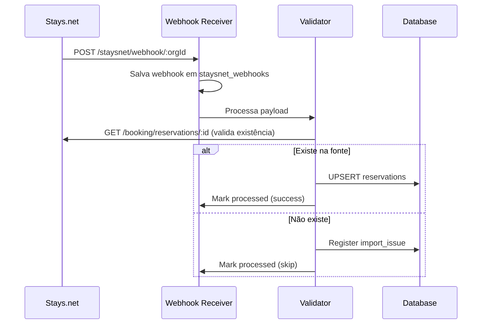
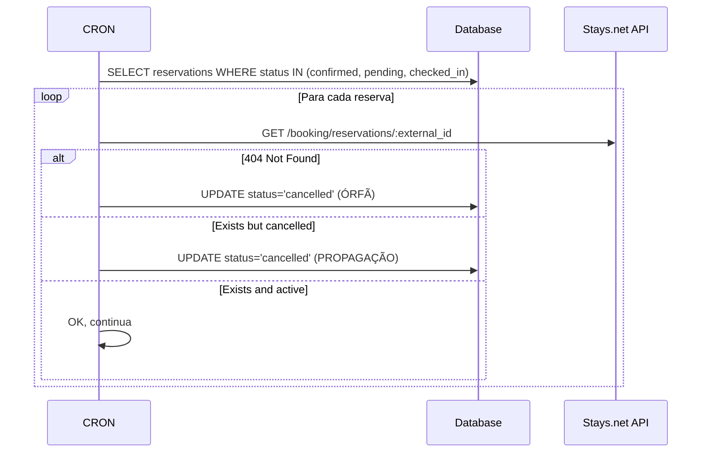

# 📚 ADR: RESERVATION RECONCILIATION SYSTEM

**Versão:** 1.1.0  
**Data:** 2026-01-21  
**Status:** ✅ IMPLEMENTADO  
**Autor:** Sistema de gestão de reservas multi-canal  

---

## 📋 SUMÁRIO

1. [Contexto e Problema](#1-contexto-e-problema)
2. [Decisão](#2-decisão)
3. [Arquitetura](#3-arquitetura)
4. [Regras Canônicas](#4-regras-canônicas)
5. [Fluxos de Dados](#5-fluxos-de-dados)
6. [Endpoints de API](#6-endpoints-de-api)
7. [Troubleshooting](#7-troubleshooting)
8. [Histórico de Incidentes](#8-histórico-de-incidentes)

---

## 1. CONTEXTO E PROBLEMA

### O Problema
Em 2026-01-20, detectamos 6 reservas no Rendizy que **não existiam na fonte** (Stays.net):
- 5 já estavam canceladas no Rendizy
- 1 (FN26J) estava como "confirmed" mas não existia na API Stays

### Causa Raiz
1. **Falta de validação de existência**: Reservas eram criadas no Rendizy sem validar se existiam na fonte
2. **Sem reconciliação periódica**: Não havia mecanismo para detectar reservas órfãs
3. **Identidade fragmentada**: Mistura de IDs (external_id vs id vs staysnet_reservation_code)

### Impacto
- Cards fantasma no calendário
- Erros em checklist de check-in
- Dados financeiros incorretos

---

## 2. DECISÃO

Implementar um **Sistema de Reconciliação Bidirecional** que:

1. **Valida antes de persistir** - Toda reserva de webhook é validada na fonte antes de salvar
2. **Reconcilia periodicamente** - CRON verifica reservas ativas contra a fonte
3. **Detecta órfãos automaticamente** - Reservas que não existem na fonte são canceladas
4. **Propaga cancelamentos** - Se fonte cancela, Rendizy cancela

---

## 3. ARQUITETURA

```
┌─────────────────────────────────────────────────────────────────────┐
│                         FONTES EXTERNAS                              │
├─────────────────────────────────────────────────────────────────────┤
│  Stays.net      │  Airbnb API    │  Booking.com    │  Manual/Direct │
│  (webhook)      │  (webhook)     │  (webhook)      │  (frontend)    │
└────────┬────────┴────────┬───────┴────────┬────────┴────────┬───────┘
         │                 │                │                 │
         ▼                 ▼                ▼                 ▼
┌─────────────────────────────────────────────────────────────────────┐
│                    CAMADA DE VALIDAÇÃO                               │
├─────────────────────────────────────────────────────────────────────┤
│  validateReservationBeforePersist()                                  │
│  - property_id obrigatório                                          │
│  - external_id único por (org, platform)                            │
│  - check_in < check_out                                             │
│  - [opcional] validateReservationExistsInSource()                    │
└────────────────────────────────────────┬────────────────────────────┘
                                         │
                                         ▼
┌─────────────────────────────────────────────────────────────────────┐
│                      BANCO DE DADOS                                  │
├─────────────────────────────────────────────────────────────────────┤
│  reservations                                                        │
│  ├── id (UUID interno)                                              │
│  ├── organization_id                                                │
│  ├── platform (staysnet/airbnb/booking/direct)                      │
│  ├── external_id (ID na fonte - CHAVE CANÔNICA)                     │
│  ├── property_id (FK obrigatória)                                   │
│  ├── status (pending/confirmed/checked_in/checked_out/cancelled)    │
│  ├── staysnet_raw (payload completo para debug)                     │
│  └── UNIQUE(organization_id, platform, external_id)                 │
└────────────────────────────────────────┬────────────────────────────┘
                                         │
                                         ▼
┌─────────────────────────────────────────────────────────────────────┐
│                   RECONCILIAÇÃO (CRON)                               │
├─────────────────────────────────────────────────────────────────────┤
│  reconcileReservations()                                             │
│  - Lista reservas ativas (confirmed, pending, checked_in)            │
│  - Para cada: valida se existe na fonte                             │
│  - Se não existe → ÓRFÃ → cancela automaticamente                   │
│  - Se existe mas cancelada na fonte → propaga cancelamento          │
└─────────────────────────────────────────────────────────────────────┘
```

---

## 4. REGRAS CANÔNICAS

### 🔒 REGRA #1: Reserva sem property_id NÃO EXISTE

```typescript
// ❌ ERRADO - Salvar sem property
if (!sqlData.property_id) {
  console.warn('Skipping...');
}

// ✅ CORRETO - Registrar issue e não salvar
if (!sqlData.property_id) {
  await upsertStaysnetImportIssueMissingPropertyMapping(supabase, {...});
  skipped++;
  await markWebhookProcessed(hook.id, 'property not resolved');
  continue;
}
```

### 🔒 REGRA #2: Identidade Canônica

A **identidade única** de uma reserva é a tupla:
```
(organization_id, platform, external_id)
```

Onde:
- `organization_id`: UUID da imobiliária
- `platform`: string normalizada (staysnet, airbnb, booking, direct)
- `external_id`: ID na fonte (ex: `_id` do Stays.net)

### 🔒 REGRA #3: Cancelamentos SEMPRE Propagam

```typescript
// Se a fonte diz que está cancelada, nós cancelamos
if (validation.sourceCancelled && reservation.status !== 'cancelled') {
  await supabase.from('reservations').update({
    status: 'cancelled',
    cancelled_at: new Date().toISOString(),
    cancellation_reason: 'RECONCILIATION: Cancelled in source system',
  });
}
```

### 🔒 REGRA #4: Reserva Órfã = Cancela Automaticamente

```typescript
// Se não existe na fonte, é órfã
if (!validation.existsInSource) {
  await supabase.from('reservations').update({
    status: 'cancelled',
    cancelled_at: new Date().toISOString(),
    cancellation_reason: 'RECONCILIATION: Reservation not found in source (orphan)',
  });
}
```

---

## 5. FLUXOS DE DADOS

### 5.1 Webhook Recebido



### 5.2 Reconciliação CRON



---

## 6. ENDPOINTS DE API

### POST /reconciliation/reservations/:organizationId

Executa reconciliação de reservas.

**Query Params:**
| Param | Tipo | Default | Descrição |
|-------|------|---------|-----------|
| limit | number | 100 | Máximo de reservas (max: 500) |
| autoCancelOrphans | boolean | true | Cancela órfãs automaticamente |
| checkInFrom | string | - | Data inicial (YYYY-MM-DD) |
| checkInTo | string | - | Data final (YYYY-MM-DD) |

**Response:**
```json
{
  "success": true,
  "data": {
    "stats": {
      "totalScanned": 50,
      "validatedOk": 47,
      "orphansDetected": 2,
      "orphansCancelled": 2,
      "errorsFromSource": 1,
      "alreadyCancelled": 0
    },
    "orphanReservations": [
      {
        "id": "uuid",
        "external_id": "FN26J",
        "status": "confirmed",
        "reason": "Reservation does not exist in source (404)",
        "action_taken": "cancelled"
      }
    ],
    "errors": []
  }
}
```

### GET /reconciliation/missing/:organizationId

Lista reservas que existem na fonte mas NÃO existem no Rendizy.

**Query Params:**
| Param | Tipo | Obrigatório | Descrição |
|-------|------|-------------|-----------|
| checkInFrom | string | ✅ | Data inicial (YYYY-MM-DD) |
| checkInTo | string | ✅ | Data final (YYYY-MM-DD) |

### GET /reconciliation/health/:organizationId

Métricas de saúde para dashboard.

**Response:**
```json
{
  "success": true,
  "data": {
    "metrics": {
      "activeReservations": 42,
      "orphanReservations": 0,
      "checkInsToday": 3,
      "pendingImportIssues": 0
    },
    "health": {
      "status": "healthy",
      "issues": []
    }
  }
}
```

---

## 7. TROUBLESHOOTING

### Problema: Reserva aparece no Stays mas não no Rendizy

**Causa:** Webhook falhou ou property não estava mapeada

**Solução:**
```bash
# 1. Verificar issues de import
curl "https://API/reconciliation/missing/ORG_ID?checkInFrom=2026-01-20&checkInTo=2026-01-25"

# 2. Se houver missing, verificar staysnet_import_issues
SELECT * FROM staysnet_import_issues 
WHERE organization_id = 'ORG_ID' AND status = 'open';

# 3. Reprocessar webhooks pendentes
curl -X POST "https://API/staysnet/webhooks/process/ORG_ID?limit=100"
```

### Problema: Reserva no Rendizy mas não no Stays (ÓRFÃ)

**Causa:** Reserva foi deletada na fonte sem enviar webhook de cancelamento

**Solução:**
```bash
# Executar reconciliação
curl -X POST "https://API/reconciliation/reservations/ORG_ID?autoCancelOrphans=true"
```

### Problema: Reserva duplicada

**Causa:** Diferentes IDs para mesma reserva (confirmationCode vs _id)

**Solução:**
```sql
-- Encontrar duplicatas por datas + property
SELECT property_id, check_in, check_out, COUNT(*) as cnt
FROM reservations
WHERE organization_id = 'ORG_ID'
GROUP BY property_id, check_in, check_out
HAVING COUNT(*) > 1;

-- Manter apenas a com external_id (mais confiável)
DELETE FROM reservations
WHERE id IN (
  SELECT id FROM reservations r1
  WHERE EXISTS (
    SELECT 1 FROM reservations r2
    WHERE r2.property_id = r1.property_id
    AND r2.check_in = r1.check_in
    AND r2.external_id IS NOT NULL
    AND r1.external_id IS NULL
  )
);
```

---

## 8. HISTÓRICO DE INCIDENTES

### Incidente 2026-01-20: 6 Reservas Órfãs Detectadas

**Timeline:**
- 10:00 - Usuário reporta discrepância: Stays mostra 13 checkouts, Rendizy mostra 14
- 10:30 - Investigação identifica 6 reservas extras no Rendizy
- 11:00 - Análise revela: 5 já canceladas, 1 (FN26J) ainda como "confirmed"
- 11:15 - Validação contra API Stays: FN26J retorna 404
- 11:30 - Reserva FN26J cancelada manualmente
- 12:00 - Sistema de reconciliação implementado

**Ação Preventiva:**
- Implementado `utils-reservation-reconciliation.ts`
- Implementado `routes-reconciliation.ts`
- CRON sugerido para execução diária

**Lições Aprendidas:**
1. Webhooks podem falhar silenciosamente
2. Fonte externa é a autoridade (Stays, Airbnb, Booking)
3. Reconciliação periódica é OBRIGATÓRIA
4. Toda reserva deve ter `external_id` para rastreabilidade

---

## ARQUIVOS RELACIONADOS

| Arquivo | Descrição |
|---------|-----------|
| `utils-reservation-reconciliation.ts` | Core do sistema de reconciliação |
| `routes-reconciliation.ts` | Endpoints de API |
| `routes-staysnet-webhooks.ts` | Processamento de webhooks Stays |
| `utils-staysnet-import-issues.ts` | Registro de issues de import |
| `ADR_STAYSNET_WEBHOOK_REFERENCE.md` | Referência técnica de webhooks |

---

## CHANGELOG

| Data | Versão | Descrição |
|------|--------|-----------|
| 2026-01-21 | 1.1.0 | Webhook inline handler, auto-process, auto-sync endpoint |
| 2026-01-20 | 1.0.0 | Criação após incidente de reservas órfãs |

---

## 9. ATUALIZAÇÕES 2026-01-21

### 9.1 Problema: URL de Webhook Incorreta

**Descoberta:**
A URL configurada no Stays.net estava apontando para uma função inexistente:
```
❌ ERRADA: /functions/v1/staysnet-webhook-receiver/...
✅ CORRETA: /functions/v1/rendizy-server/staysnet/webhook/:orgId
```

**Impacto:** Webhooks retornavam 404, reservas não sincronizavam em tempo real.

**Correção:** URL correta configurada no Stays.net:
```
https://odcgnzfremrqnvtitpcc.supabase.co/functions/v1/rendizy-server/staysnet/webhook/00000000-0000-0000-0000-000000000000
```

### 9.2 Problema: ExecutionContext Error

**Sintoma:** Webhook retornava HTTP 500: `"This context has no ExecutionContext"`

**Causa:** Função `receiveStaysNetWebhook` usava APIs não disponíveis no Deno Deploy.

**Solução:** Handler inline no `index.ts` com imports dinâmicos:
```typescript
const webhookHandler = async (c: HonoContext) => {
  // Import dinâmico para evitar problemas de inicialização
  const { SUPABASE_URL, SUPABASE_SERVICE_ROLE_KEY } = await import('./utils-env.ts');
  const { createClient } = await import('jsr:@supabase/supabase-js@2');
  // ... resto do handler
};
```

### 9.3 Novo: Processamento Automático de Webhooks

Quando um webhook chega, o sistema agora processa automaticamente até 20 webhooks pendentes:
```typescript
// Após salvar webhook, dispara processamento
const { processPendingStaysNetWebhooksForOrg } = await import('./routes-staysnet-webhooks.ts');
await processPendingStaysNetWebhooksForOrg(organizationId, 20);
```

### 9.4 Novo Endpoint: Auto-Sync

```
POST /reconciliation/auto-sync/:organizationId?date=YYYY-MM-DD
```

Executa reconciliação completa:
1. Busca reservas do Stays.net para a data
2. Compara com Rendizy
3. Sincroniza reservas faltantes automaticamente

### 9.5 Reservas Canceladas Sincronizadas

Reservas com status `canceled` no Stays agora são atualizadas para `cancelled` no Rendizy:
- FP20J (cancelada)
- FP16J (cancelada)
- FO24J (cancelada)
